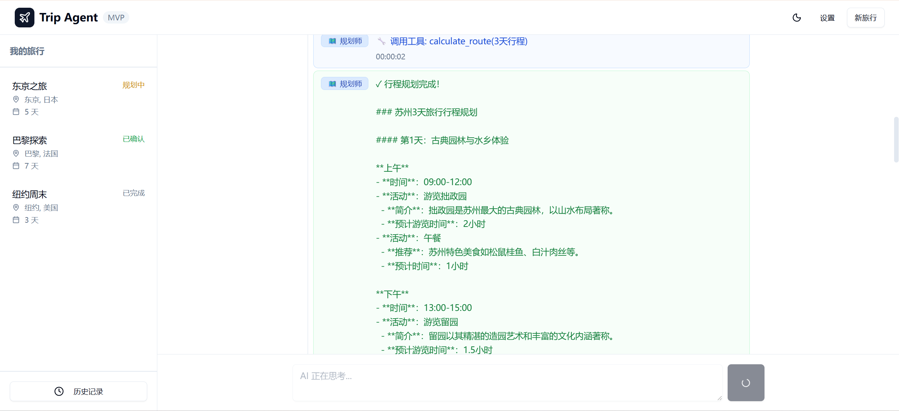
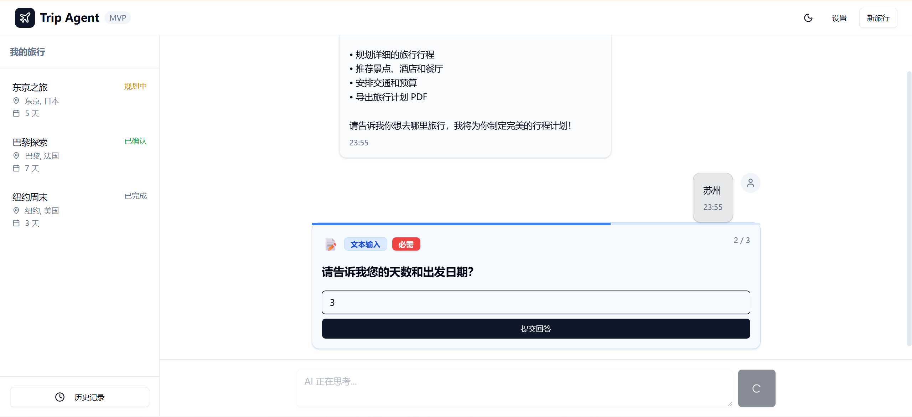
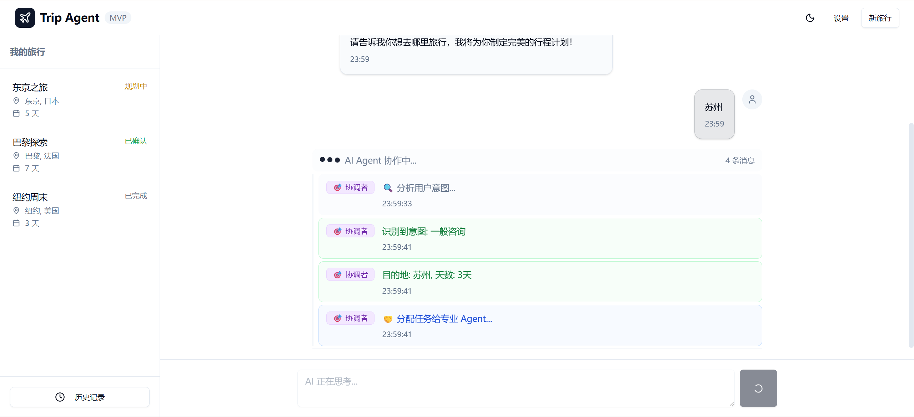

# Trip Agent

基于 Multi-Agent 系统的智能旅行规划助手，使用 React + TypeScript + Tauri 构建。

## 功能特性

- **Multi-Agent 系统**: 5 个专业 Agent 协同工作（协调者、规划师、推荐师、预订师、文档师）
- **A2UI 主动询问**: 智能收集缺失的旅行信息（目的地、天数、预算、偏好）
- **AGUI 实时界面**: 可视化展示 Agent 思考过程和工具调用状态
- **Agent 协作流程**: Multi-Agent 系统协调各专业 Agent 生成完整旅行方案
- **LLM 集成**: 使用智谱 AI GLM-4-Flash 生成个性化行程
- **外部 API 集成**: OpenWeatherMap、Google Places 提供实时数据
- **Tauri 桌面应用**: 跨平台桌面应用支持

## 技术栈

- **前端**: React 19 + TypeScript + Vite
- **UI**: shadcn/ui + Tailwind CSS
- **状态管理**: Zustand
- **LLM**: 智谱 AI GLM-4-Flash
- **外部 API**: OpenWeatherMap, Google Places
- **桌面端**: Tauri (Rust)

## 开发环境设置

### 前置要求

确保你的系统已安装以下软件：

- **Node.js**: v18+ (推荐 v20+)
- **pnpm**: 最新版本
- **Rust**: 最新版本（用于 Tauri 桌面应用）
- **Cargo**: Rust 包管理器（用于 Tauri）

### 1. 安装依赖

#### Windows 系统

**安装 Node.js 和 pnpm:**
1. 下载并安装 Node.js: https://nodejs.org/
2. 打开新的命令提示符(CMD)
3. 安装 pnpm: `npm install -g pnpm`

**安装 Rust 和 Cargo:**
1. 访问 https://www.rust-lang.org/tools/install.html
2. 下载并运行 `rustup-init.exe` (Windows x64)
3. 打开新的命令提示符窗口
4. 按照屏幕提示完成安装

#### 验证安装

打开新的命令提示符窗口，运行以下命令验证：

```bash
node --version
pnpm --version
rustc --version
cargo --version
```

### 2. 配置环境变量

复制项目根目录的 `.env.example` 为 `.env` 并配置：

```env
# 智谱 AI GLM API (必需 - 用于行程生成)
VITE_GLM_API_KEY=your_glm_api_key_here

# OpenWeatherMap API (天气数据)
VITE_OPENWEATHER_API_KEY=your_openweather_api_key_here

# Google Places API (景点、酒店推荐)
VITE_GOOGLE_PLACES_API_KEY=your_google_places_api_key_here
```

### 3. 运行开发服务器

```bash
# 安装依赖
pnpm install

# 启动开发服务器
pnpm dev

# 启动 Tauri 开发模式
pnpm tauri dev
```

### 4. 运行测试

```bash
# 运行所有测试
pnpm test

# 测试 UI 模式
pnpm test:ui
```

## 项目结构

```
trip-agent/
├── src/
│   ├── components/      # React 组件
│   │   ├── chat/       # 聊天界面组件
│   │   ├── ui/          # shadcn/ui 组件
│   │   ├── stores/       # Zustand 状态管理
│   ├── services/       # 业务逻辑服务
│   │   ├── multiAgentService.ts  # Multi-Agent 核心逻辑
│   │   ├── llmService.ts         # LLM API 集成
│   │   ├── externalApiService.ts   # 外部 API 集成
│   │   └── tauri/              # Tauri Rust 后端
│   ├── stores/         # Zustand 状态管理
│   ├── lib/            # 工具库
│   └── types/          # TypeScript 类型定义
├── src-tauri/       # Tauri Rust 源码
└── docs/               # 项目文档
```

## Agent 架构

### Multi-Agent 协作流程



### 专业 Agent 分工

| Agent | 职责 |
|-------|------|
| SupervisorAgent | 协调 |
| PlannerAgent | 规划 |
| RecommenderAgent | 推荐 |
| BookingAgent | 预订 |
| DocumentAgent | 文档 |

### A2UI - 智能信息收集

当用户信息不完整时，系统会主动询问补充信息：


### AGUI - 实时进度展示

可视化展示 Agent 思考过程和工具调用状态：


## API 密钥获取

### 智谱 AI

https://open.bigmodel.cn/

### OpenWeatherMap

https://openweathermap.org/api

### Google Places

https://developers.google.com/maps/documentation/places/web-service/get-api-key

## 构建桌面应用

### 开发模式

```bash
pnpm tauri dev
```

### 生产构建

```bash
pnpm tauri build
```

## 许可证

MIT License
