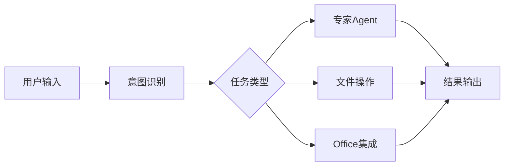

# Trip Agent - 完善调研报告

> 版本: v2.0 | 更新时间: 2025-02-10

---

## 目录

1. [执行摘要](#执行摘要)
2. [市场分析](#市场分析)
3. [竞品深度分析](#竞品深度分析)
4. [用户需求洞察](#用户需求洞察)
5. [产品方案设计](#产品方案设计)
6. [技术架构方案](#技术架构方案)
7. [实施路线图](#实施路线图)
8. [风险评估](#风险评估)
9. [商业策略](#商业策略)

---

## 执行摘要

### 产品定位
**Trip Agent** 是一款基于 AI 的本地优先桌面旅游规划助手，通过多 Agent 协作提供专业的旅游规划服务。

### 核心价值主张
| 维度 | 传统方案 | 竞品 (Layla/Mindtrip) | Trip Agent |
|------|----------|----------------------|------------|
| 部署方式 | Web/App | Web | 本地桌面 |
| 数据隐私 | 云端 | 云端 | **本地存储** |
| 垂直深度 | 人工搜索 | 通用规划 | **旅游专精** |
| Agent 能力 | 无 | 单一 Agent | **多 Agent 协作** |
| 离线能力 | 无 | 无 | **支持离线** |

### 市场机会
- **AI 桌面 Agent 元年**: 2025-2026 年，Claude Cowork、阶跃 AI、阿里 QoderWork 纷纷入局
- **旅游 AI 融资活跃**: Mindtrip 获 $22.5M 融资，美国航空/资本领投
- **本地存储需求**: 用户对隐私和数据控制的需求日益增长

---

## 市场分析

### 1. AI 桌面 Agent 市场格局 (2025-2026)

#### 市场驱动因素
```
Claude Cowork 发布 (2026.01)
         ↓
    桌面入口争夺战
         ↓
┌────────┬────────┬────────┬────────┐
│ Claude │ 阶跃AI │ 阿里Qoder │ MiniMax │
│ Cowork │ 桌面伙伴│  Work   │ Agent  │
└────────┴────────┴────────┴────────┘
```

#### 竞品功能对比

| 产品 | 厂商 | 价格 | 核心特点 | 优势 |
|------|------|------|----------|------|
| **Claude Cowork** | Anthropic | ¥140/月 | 双模型、永久记忆 | 行业标杆 |
| **阶跃AI桌面伙伴** | 阶跃星辰 | **完全免费** | MCP协议、16款软件集成 | 性价比最高 |
| **QoderWork** | 阿里 | 未公开 | 本地执行、系统级权限 | 安全性强 |
| **MiniMax Agent 2.0** | MiniMax | 未公开 | 专家Agent、Office集成 | 办公场景强 |
| **讯飞星火** | 科大讯飞 | 部分付费 | 文档处理、知识库 | 传统AI厂商 |

#### 关键洞察
1. **价格战已开启**: 阶跃AI完全免费策略将倒逼行业降价
2. **MCP 成为标准**: 多产品支持 Model Context Protocol
3. **本地化趋势**: QoderWork 完全本地执行代表安全趋势
4. **主动性增强**: 从被动响应到主动服务

### 2. 旅游 AI 规划市场

#### 竞品分析

| 竞品 | 融资情况 | 核心功能 | 技术特点 |
|------|----------|----------|----------|
| **Mindtrip** | $22.5M | 对话规划+预订 | 集成预订平台 |
| **Layla** | 收购 Roam Around | 视频内容+灵感 | TikTok风格展示 |
| **Trip Planner AI** | 未公开 | 行程自动化 | 智能优化 |
| **GuideGeek** | TripAdvisor旗下 | 本地推荐 | 强大数据库 |

#### 差异化机会
| 维度 | 竞品 | 我们的机会 |
|------|------|-----------|
| 部署 | Web | **本地桌面** |
| 存储 | 云端 | **本地隐私** |
| 垂直 | 通用 | **旅游专精** |
| Agent | 单一 | **多Agent协作** |
| 离线 | 不支持 | **离线可用** |

---

## 竞品深度分析

### 1. MiniMax Agent 2.0

#### 产品定位
> "AI 原生工作台，重塑生产力"

#### 核心功能


#### 功能清单
| 功能模块 | 具体功能 | 技术实现 |
|----------|----------|----------|
| **专家 Agents** | 写作、分析、编程等 | Agent 路由系统 |
| **Office 集成** | PPT/Excel/Word/PDF | 文件 API 调用 |
| **MCP 支持** | 扩展工具调用 | 标准 MCP 协议 |
| **多模态** | 文字/图片/语音 | 多模态模型 |
| **记忆系统** | 上下文记忆 | 向量存储 |

#### 可借鉴设计
- ✅ 专家 Agent 分工模式
- ✅ 文件系统深度集成
- ✅ 任务进度可视化
- ✅ 快捷操作面板

### 2. 阶跃 AI 桌面伙伴

#### 产品定位
> "完全免费的国产 Claude Cowork 替代品"

#### 核心优势
| 优势 | 说明 |
|------|------|
| **完全免费** | 无使用限制 |
| **MCP 协议** | 兼容 Claude Skills 生态 |
| **16款软件集成** | Excel、飞书、钉钉、Notion 等 |
| **主动执行** | 喝水提醒、久坐提醒 |
| **全局记忆** | 跨应用自动同步 |

#### 技术架构
```
┌─────────────────────────────────────┐
│         用户界面层                  │
├─────────────────────────────────────┤
│         MCP 协议层                  │
├─────────────────────────────────────┤
│    Skills 生态系统      │
├─────────────────────────────────────┤
│         执行引擎层                  │
└─────────────────────────────────────┘
```

### 3. 阿里 QoderWork

#### 产品定位
> "人人都能拥有的桌面 AI 助理"

#### 核心特性
| 特性 | 技术实现 |
|------|----------|
| **本地化执行** | 所有处理在本地完成 |
| **系统级权限** | 深度系统集成 |
| **MCP 协议** | 内置支持 |
| **自动制作 PPT/视频** | 多模态生成 |
| **顶尖大模型** | 集成全球模型 |

#### 安全架构
```
用户请求 → 本地处理 → 安全沙箱 → 结果返回
    ↑                              ↓
    └────── 数据不出域 ──────────────┘
```

### 4. Claude Cowork (Anthropic)

#### 产品定位
> AI 桌面 Agent 的行业标杆

#### 核心创新
| 创新 | 说明 |
|------|------|
| **双模型支持** | Claude + Gemini |
| **永久记忆** | 持续学习用户习惯 |
| **文件夹代理** | 自动管理文件 |
| **零门槛** | 无需编程知识 |

#### 定价策略
- **约 ¥140/月** (中国区)
- 按需付费模式
- 企业版定制

### 5. Mindtrip AI

#### 融资情况
| 轮次 | 金额 | 投资方 | 时间 |
|------|------|--------|------|
| Seed | $7M | Costanoa Ventures | 2023.09 |
| Series A | $12M | 未公开 | 2024.09 |
| 战略投资 | 未公开 | Amex/Capital One/United | 2025 |

#### 产品特点
```typescript
interface MindtripFeatures {
  conversational: boolean      // 对话式界面
  integratedBooking: boolean   // 集成预订
  onTripCompanion: boolean     // 旅行中助手
  smartRecommendations: boolean // 智能推荐
  receiptManagement: boolean   // 票据管理
}
```

---

## 用户需求洞察

### 1. 目标用户画像

#### 主要用户群体

| 用户类型 | 占比 | 核心需求 | 使用场景 |
|----------|------|----------|----------|
| **休闲旅行者** | 60% | 简单规划、预算控制 | 家庭度假、情侣出游 |
| **商务旅行者** | 25% | 高效安排、商务配套 | 出差、会议 |
| **探险爱好者** | 10% | 小众景点、深度体验 | 特色旅行 |
| **专业规划师** | 5% | 效率工具、客户交付 | 商业服务 |

#### 用户旅程地图
```
灵感阶段 → 规划阶段 → 预订阶段 → 行程中 → 分享阶段
   ↓         ↓         ↓         ↓         ↓
 社交媒体   AI规划    比价预订   实时助手   回忆整理
```

### 2. 核心痛点

| 痛点 | 严重度 | 现有方案问题 | 我们的价值 |
|------|--------|--------------|-----------|
| **信息分散** | ⭐⭐⭐⭐⭐ | 需切换多个网站 | 一站式整合 |
| **规划耗时** | ⭐⭐⭐⭐⭐ | 人工研究耗时长 | AI 自动生成 |
| **经验不足** | ⭐⭐⭐⭐ | 不了解当地特色 | 本地知识库 |
| **协同困难** | ⭐⭐⭐ | 多人协作不便 | 分享与同步 |
| **隐私担忧** | ⭐⭐⭐⭐ | 数据存在云端 | 本地存储 |

### 3. 用户期望排名

根据调研，用户对旅游 AI 工具的期望排序：

| 排名 | 期望 | 重要度 |
|------|------|--------|
| 1 | 行程自动生成 | 98% |
| 2 | 预算估算 | 92% |
| 3 | 当地推荐 | 89% |
| 4 | 预订链接 | 85% |
| 5 | 离线可用 | 78% |
| 6 | 多人协作 | 71% |
| 7 | 社交分享 | 65% |

---

## 产品方案设计

### 1. 产品架构

#### 整体架构图
```
┌─────────────────────────────────────────────────────────────────┐
│                         用户交互层                               │
│  ┌──────────────┐  ┌──────────────┐  ┌──────────────┐          │
│  │  聊天界面    │  │  行程看板    │  │  地图视图    │          │
│  │  Chat UI     │  │  Timeline    │  │  Map View    │          │
│  └──────────────┘  └──────────────┘  └──────────────┘          │
├─────────────────────────────────────────────────────────────────┤
│                         Agent 协作层                             │
│  ┌─────────────────────────────────────────────────────────┐   │
│  │                    Supervisor Agent                      │   │
│  │  ┌─────────┐ ┌─────────┐ ┌─────────┐ ┌─────────┐      │   │
│  │  │规划Agent│ │推荐Agent│ │预订Agent│ │文档Agent│      │   │
│  │  └─────────┘ └─────────┘ └─────────┘ └─────────┘      │   │
│  └─────────────────────────────────────────────────────────┘   │
├─────────────────────────────────────────────────────────────────┤
│                         能力服务层                               │
│  ┌──────────┐  ┌──────────┐  ┌──────────┐  ┌──────────┐      │
│  │LLM 服务  │  │向量检索  │  │MCP 集成  │  │记忆管理  │      │
│  └──────────┘  └──────────┘  └──────────┘  └──────────┘      │
├─────────────────────────────────────────────────────────────────┤
│                         数据存储层                               │
│  ┌──────────┐  ┌──────────┐  ┌──────────┐  ┌──────────┐      │
│  │本地文件  │  │向量数据库│  │用户偏好  │  │对话历史  │      │
│  └──────────┘  └──────────┘  └──────────┘  └──────────┘      │
├─────────────────────────────────────────────────────────────────┤
│                         外部 API 层                              │
│  ┌────────┐  ┌────────┐  ┌────────┐  ┌────────┐              │
│  │地图API │  │天气API │  │酒店API │  │航班API │              │
│  └────────┘  └────────┘  └────────┘  └────────┘              │
└─────────────────────────────────────────────────────────────────┘
```

### 2. Agent 角色设计

#### Supervisor Agent (总控)
```typescript
interface SupervisorAgent {
  responsibilities: [
    "理解用户意图",
    "任务分解与分配",
    "Agent 协调调度",
    "结果汇总验证"
  ]
  tools: [
    "Agent Router",
    "Task Decomposer",
    "Result Validator"
  ]
}
```

#### Planner Agent (规划)
```typescript
interface PlannerAgent {
  responsibilities: [
    "生成每日行程",
    "时间安排优化",
    "路线规划",
    "预算估算"
  ]
  tools: [
    "地图服务",
    "天气 API",
    "日历工具",
    "预算计算器"
  ]
  output: "结构化行程数据"
}
```

#### Recommender Agent (推荐)
```typescript
interface RecommenderAgent {
  responsibilities: [
    "景点推荐",
    "酒店推荐",
    "餐厅推荐",
    "活动推荐"
  ]
  tools: [
    "向量检索",
    "评分数据",
    "用户偏好",
    "本地知识"
  ]
  output: "推荐列表 + 理由"
}
```

#### Booking Agent (预订)
```typescript
interface BookingAgent {
  responsibilities: [
    "价格比较",
    " availability 检查",
    "预订链接生成",
    "优惠信息"
  ]
  tools: [
    "酒店比价 API",
    "机票搜索 API",
    "优惠券引擎"
  ]
  output: "最佳预订方案"
}
```

#### Document Agent (文档)
```typescript
interface DocumentAgent {
  responsibilities: [
    "行程单生成",
    "PDF/图片导出",
    "分享链接",
    "打印格式"
  ]
  tools: [
    "模板引擎",
    "PDF 生成器",
    "图片渲染"
  ]
  output: "可分享文档"
}
```

### 3. 用户界面设计

#### 主界面布局
```
┌────────────────────────────────────────────────────────────────┐
│  Trip Agent                    🔔  ⚙️  👤                     │
├──────────┬─────────────────────────────────────────────────────┤
│          │                                                     │
│  📁 旅行  │  ┌─────────────────────────────────────────────┐   │
│          │  │                                             │   │
│  ├─ 日本  │  │  用户: 帮我规划一个5天的日本东京之旅        │   │
│  ├─ 欧洲  │  │       预算2万，喜欢动漫和美食              │   │
│  └─ 三亚  │  │                                             │   │
│          │  │  Agent: 好的！正在为您规划...  ⏳          │   │
│  ────────│  │                                             │   │
│  + 新建   │  │  ┌───────────────────────────────────────┐  │   │
│          │  │  │  🗓️ 东京5日深度游                      │  │   │
│          │  │  │  📅 2025.04.01 - 2025.04.05           │  │   │
│          │  │  │  💰 预算: ¥20,000                      │  │   │
│          │  │  │                                        │  │   │
│          │  │  │  Day 1 - 抵达与初探                     │  │   │
│          │  │  │  ✈️ 成田机场 → 新宿                    │  │   │
│          │  │  │  🍜 一兰拉面 (新宿中央店)              │  │   │
│          │  │  │  🏨 新宿格拉斯丽酒店                   │  │   │
│          │  │  │  🌃 歌舞伎町夜景                        │  │   │
│          │  │  │                                        │  │   │
│          │  │  │  [查看完整行程] [编辑] [导出PDF]       │  │   │
│          │  │  └───────────────────────────────────────┘  │   │
│          │  │                                             │   │
│          │  │  [输入您的需求...]               📎 🎤      │   │
│          │  └─────────────────────────────────────────────┘   │
│          │                                                     │
│          │  ┌─────────────────────────────────────────────┐   │
│          │  │  快速操作                                    │   │
│          │  │  [✨ 生成行程] [🏨 推荐酒店] [✈️ 查机票]    │   │
│          │  │  [🍜 美食推荐] [🎡 景点] [📄 导出行程]      │   │
│          │  └─────────────────────────────────────────────┘   │
└──────────┴─────────────────────────────────────────────────────┘
```

#### UI 设计原则

基于 [AI UI Patterns](https://www.patterns.dev/react/ai-ui-patterns/) 和 [7 Key Design Patterns for AI Interfaces](https://uxplanet.org/7-key-design-patterns-for-ai-interfaces-893ab96988f6)：

| 原则 | 说明 | 实现方式 |
|------|------|----------|
| **流式响应** | 实时显示生成内容 | 逐字流式输出 |
| **状态可见** | 显示 Agent 执行状态 | 进度条/加载动画 |
| **可中断** | 允许用户随时停止 | 取消按钮 |
| **结构化输出** | 卡片/表格展示 | 组件化渲染 |
| **快速操作** | 常用功能一键触达 | 快捷按钮 |

#### 交互设计模式

```typescript
// 流式响应示例
interface StreamingResponse {
  text: string              // 逐步生成的文本
  isComplete: boolean       // 是否完成
  thinking?: string         // 思考过程（可选显示）
  tools?: ToolCall[]        // 工具调用记录
}

// 状态管理
interface AgentState {
  status: 'idle' | 'thinking' | 'acting' | 'completed' | 'error'
  currentStep?: string      // 当前步骤描述
  progress?: number         // 进度 0-100
  error?: ErrorInfo
}
```

---

## 技术架构方案

### 1. 技术栈选型

#### 最终选择

| 层级 | 技术选择 | 理由 | 替代方案 |
|------|----------|------|----------|
| **桌面框架** | Tauri 2.0 | 体积小(~10MB)、安全(Rust)、性能高 | Electron |
| **前端框架** | React 19 + TS | 企业级、生态丰富、并发特性 | Vue 3 / Svelte |
| **UI 组件** | shadcn/ui + Tailwind | 可定制、现代、无障碍 | Material-UI / AntD |
| **状态管理** | Zustand | 轻量、简单、TypeScript 友好 | Redux / Jotai |
| **Agent 框架** | LangGraph | 多 Agent、可视化、LangChain 生态 | LangChain / CrewAI |
| **LLM 接口** | OpenAI SDK | 兼容性好、成本下降 85% | Anthropic / 本地模型 |
| **向量数据库** | Qdrant | 高性能、本地、元数据过滤 | Chroma / Weaviate |
| **地图服务** | 高德地图 API | 国内准确、中文支持 | 谷歌地图 |
| **协议** | MCP | 开放标准、生态丰富 | 自定义协议 |

### 2. Tauri + React 架构

#### 项目结构
```
trip-agent/
├── src-tauri/              # Rust 后端
│   ├── src/
│   │   ├── main.rs         # 主入口
│   │   ├── commands/       # Tauri 命令
│   │   ├── services/       # 业务服务
│   │   └── utils/          # 工具函数
│   ├── Cargo.toml
│   └── tauri.conf.json
├── src/                    # React 前端
│   ├── components/         # UI 组件
│   │   ├── ui/             # shadcn/ui 组件
│   │   ├── chat/           # 聊天相关
│   │   ├── itinerary/      # 行程相关
│   │   └── map/            # 地图相关
│   ├── lib/                # 工具库
│   ├── hooks/              # React Hooks
│   ├── stores/             # Zustand 状态
│   ├── services/           # API 服务
│   └── App.tsx
├── python/                 # Python 服务 (可选)
│   ├── agents/             # LangGraph Agents
│   ├── services/           # LLM/向量服务
│   └── main.py
└── package.json
```

#### 前后端通信
```typescript
// Tauri Command 定义
// src-tauri/src/commands/trip.rs

#[tauri::command]
async fn create_trip(destination: String, days: u32) -> Result<Trip, String> {
    // 调用 Python Agent 服务
    let trip = agent_service::plan_trip(destination, days).await?;
    Ok(trip)
}

#[tauri::command]
async fn chat(message: String, context: ChatContext) -> Result<ChatResponse, String> {
    let response = agent_service::chat(message, context).await?;
    Ok(response)
}
```

```typescript
// React 调用
// src/services/trip.ts

import { invoke } from '@tauri-apps/api/core';

export const createTrip = async (destination: string, days: number) => {
  return await invoke<Trip>('create_trip', { destination, days });
};

export const sendMessage = async (message: string, context: ChatContext) => {
  return await invoke<ChatResponse>('chat', { message, context });
};
```

### 3. LangGraph 多 Agent 架构

#### Agent 工作流设计
```python
# python/agents/workflow.py

from langgraph.graph import StateGraph, END
from typing import TypedDict, Annotated, Sequence
import operator

class AgentState(TypedDict):
    messages: Annotated[Sequence[str], operator.add]
    trip_data: dict
    user_preferences: dict
    current_agent: str

def create_travel_planner_graph():
    workflow = StateGraph(AgentState)

    # 添加节点
    workflow.add_node("supervisor", supervisor_agent)
    workflow.add_node("planner", planner_agent)
    workflow.add_node("recommender", recommender_agent)
    workflow.add_node("booking", booking_agent)
    workflow.add_node("document", document_agent)

    # 设置入口
    workflow.set_entry_point("supervisor")

    # 添加边
    workflow.add_conditional_edges(
        "supervisor",
        route_to_agent,
        {
            "planner": "planner",
            "recommender": "recommender",
            "booking": "booking",
            "document": "document",
            "end": END
        }
    )

    # Agent 完成后返回 supervisor
    workflow.add_edge("planner", "supervisor")
    workflow.add_edge("recommender", "supervisor")
    workflow.add_edge("booking", "supervisor")
    workflow.add_edge("document", "supervisor")

    return workflow.compile()
```

#### Agent 实现
```python
# python/agents/planner.py

from langchain_core.messages import HumanMessage, AIMessage
from langchain_openai import ChatOpenAI

llm = ChatOpenAI(model="gpt-4o", temperature=0.7)

def planner_agent(state: AgentState) -> AgentState:
    """规划 Agent - 生成每日行程"""

    user_input = state["messages"][-1]
    preferences = state["user_preferences"]

    prompt = f"""
    你是一个专业的旅游规划师。请根据以下信息生成行程：

    目的地: {preferences.get('destination')}
    天数: {preferences.get('days')}
    预算: {preferences.get('budget')}
    兴趣: {preferences.get('interests')}

    请生成每日行程，包括：
    1. 上午活动
    2. 午餐推荐
    3. 下午活动
    4. 晚餐推荐
    5. 住宿建议

    返回 JSON 格式。
    """

    response = llm.invoke([HumanMessage(content=prompt)])

    return {
        "messages": [response],
        "current_agent": "planner",
        "trip_data": parse_itinerary(response.content)
    }
```

### 4. 记忆与上下文管理

#### 记忆架构
```
┌─────────────────────────────────────────────────────────┐
│                    记忆层级结构                         │
├─────────────────────────────────────────────────────────┤
│  1. 会话记忆 (Session Memory)                           │
│     - 当前对话上下文                                    │
│     - 实时偏好更新                                      │
│     - 存储时间: 会话期间                                │
├─────────────────────────────────────────────────────────┤
│  2. 短期记忆 (Short-term Memory)                        │
│     - 最近几次旅行计划                                  │
│     - 存储时间: 30天                                    │
│     - 存储位置: 本地 JSON                               │
├─────────────────────────────────────────────────────────┤
│  3. 长期记忆 (Long-term Memory)                         │
│     - 用户偏好模型                                      │
│     - 像素化标签 (Embeddings)                           │
│     - 存储位置: Qdrant 向量数据库                       │
├─────────────────────────────────────────────────────────┤
│  4. 知识库 (Knowledge Base)                             │
│     - 旅游知识                                         │
│     - 目的地信息                                       │
│     - 存储位置: Qdrant 向量数据库                       │
└─────────────────────────────────────────────────────────┘
```

#### RAG 检索增强
```python
# python/services/rag_service.py

from qdrant_client import QdrantClient
from qdrant_client.models import Distance, VectorParams, PointStruct

class RAGService:
    def __init__(self):
        self.client = QdrantClient(path="./local_qdrant")
        self.collection_name = "travel_knowledge"

    def search_knowledge(self, query: str, top_k: int = 5) -> list[dict]:
        """检索相关旅游知识"""

        # 生成查询向量
        query_vector = self.embed(query)

        # 向量搜索
        results = self.client.search(
            collection_name=self.collection_name,
            query_vector=query_vector,
            limit=top_k,
            score_threshold=0.7
        )

        return [
            {
                "content": r.payload["content"],
                "source": r.payload["source"],
                "score": r.score
            }
            for r in results
        ]

    def add_user_memory(self, user_id: str, preference: dict):
        """添加用户偏好到长期记忆"""

        preference_text = json.dumps(preference)
        vector = self.embed(preference_text)

        self.client.upsert(
            collection_name=f"user_{user_id}",
            points=[
                PointStruct(
                    id=str(uuid.uuid4()),
                    vector=vector,
                    payload={
                        "preference": preference,
                        "timestamp": datetime.now().isoformat()
                    }
                )
            ]
        )
```

### 5. UI/UX 设计实现

#### shadcn/ui 最佳实践

基于 [shadcn/ui Best Practices](https://www.rupeshpoudel.com.np/blog/shadcn-best-practices)：

| 实践 | 说明 | 示例 |
|------|------|------|
| **从基础开始** | 使用 shadcn 组件作为基础 | Button, Input, Card |
| **不直接修改** | 创建自定义组件而非修改库文件 | `components/custom/TripCard.tsx` |
| **组合而非继承** | 组合简单组件构建复杂 UI | 使用 Card + Badge 构建行程卡片 |
| **利用 Tailwind** | 使用 utility classes | `className="flex items-center gap-4"` |
| **CSS 变量** | 用于主题一致性 | `--primary`, `--radius` |

#### 组件示例
```tsx
// src/components/itinerary/DayPlanCard.tsx

import { Card, CardContent, CardHeader, CardTitle } from "@/components/ui/card";
import { Badge } from "@/components/ui/badge";
import { MapPin, Clock, Yen } from "lucide-react";

interface DayPlanCardProps {
  day: number;
  date: string;
  activities: Activity[];
}

export function DayPlanCard({ day, date, activities }: DayPlanCardProps) {
  return (
    <Card className="w-full">
      <CardHeader>
        <div className="flex items-center justify-between">
          <CardTitle>Day {day}</CardTitle>
          <Badge variant="outline">{date}</Badge>
        </div>
      </CardHeader>
      <CardContent className="space-y-4">
        {activities.map((activity, idx) => (
          <div key={idx} className="flex items-start gap-3 p-3 rounded-lg bg-muted/50">
            <div className="mt-1">
              <activity.icon className="h-5 w-5 text-primary" />
            </div>
            <div className="flex-1">
              <div className="flex items-center gap-2">
                <h4 className="font-medium">{activity.name}</h4>
                {activity.cost && (
                  <Badge variant="secondary" className="gap-1">
                    <Yen className="h-3 w-3" />
                    {activity.cost}
                  </Badge>
                )}
              </div>
              <div className="flex items-center gap-4 text-sm text-muted-foreground mt-1">
                <span className="flex items-center gap-1">
                  <Clock className="h-3 w-3" />
                  {activity.time}
                </span>
                <span className="flex items-center gap-1">
                  <MapPin className="h-3 w-3" />
                  {activity.location}
                </span>
              </div>
            </div>
          </div>
        ))}
      </CardContent>
    </Card>
  );
}
```

#### 流式响应实现
```tsx
// src/components/chat/StreamingMessage.tsx

import { useEffect, useState } from "react";
import { Typewriter } from "@/components/ui/typewriter";

interface StreamingMessageProps {
  content: string;
  onComplete?: () => void;
}

export function StreamingMessage({ content, onComplete }: StreamingMessageProps) {
  const [displayedContent, setDisplayedContent] = useState("");
  const [isStreaming, setIsStreaming] = useState(true);

  useEffect(() => {
    let index = 0;
    const speed = 20; // 打字速度

    const timer = setInterval(() => {
      if (index < content.length) {
        setDisplayedContent(content.slice(0, index + 1));
        index++;
      } else {
        setIsStreaming(false);
        onComplete?.();
        clearInterval(timer);
      }
    }, speed);

    return () => clearInterval(timer);
  }, [content]);

  return (
    <div className="flex gap-3">
      {isStreaming && (
        <div className="flex items-center gap-1 text-muted-foreground">
          <span className="animate-bounce">●</span>
          <span className="animate-bounce delay-100">●</span>
          <span className="animate-bounce delay-200">●</span>
        </div>
      )}
      <p className="flex-1">{displayedContent}</p>
    </div>
  );
}
```

---

## 实施路线图

### Phase 1: 基础框架 (Week 1-2)

**目标**: 搭建可运行的桌面应用框架

| 任务 | 产出 | 验收标准 |
|------|------|----------|
| Tauri + React 初始化 | 项目骨架 | 可运行 Hello World |
| shadcn/ui 集成 | 组件库基础 | Button, Input, Card 可用 |
| 基础布局实现 | 主界面框架 | 侧边栏+主聊天区 |
| 本地存储设计 | 数据模型 | Trip 类型定义 |
| 状态管理搭建 | Zustand stores | 可读写状态 |

### Phase 2: Agent 核心能力 (Week 3-5)

**目标**: 实现基础行程生成能力

| 任务 | 产出 | 验收标准 |
|------|------|----------|
| LangGraph 集成 | Agent 框架 | 可运行简单 Agent |
| LLM 服务集成 | OpenAI 连接 | 可调用 GPT-4o |
| 规划 Agent | 行程生成 | 输入目的地→输出行程 |
| 推荐 Agent | 景点推荐 | 返回推荐列表 |
| Qdrant 集成 | 向量检索 | 可搜索知识库 |

### Phase 3: 外部服务集成 (Week 6-7)

**目标**: 集成地图、天气等外部 API

| 任务 | 产出 | 验收标准 |
|------|------|----------|
| 高德地图 API | 地图展示 | 显示景点位置 |
| 天气 API | 天气信息 | 显示目的地天气 |
| 酒店数据 API | 酒店列表 | 返回酒店推荐 |
| 航班数据 API | 航班信息 | 返回航班查询 |

### Phase 4: 功能完善 (Week 8-9)

**目标**: 完善核心功能，优化体验

| 任务 | 产出 | 验收标准 |
|------|------|----------|
| 导出功能 | PDF 导出 | 生成可分享行程单 |
| 多模态支持 | 图片输入 | 可识别景点图片 |
| 记忆系统 | 用户偏好 | 记住用户习惯 |
| 性能优化 | 响应速度 | 流式响应 < 2s |

### Phase 5: 测试与发布 (Week 10)

**目标**: 完成测试，发布 MVP

| 任务 | 产出 | 验收标准 |
|------|------|----------|
| 端到端测试 | 测试覆盖 | 核心流程 100% |
| 用户测试 | 反馈报告 | 至少 10 人试用 |
| 打包发布 | 安装包 | Win/Mac 可安装 |
| 文档编写 | 用户手册 | 完整使用说明 |

---

## 风险评估

### 技术风险

| 风险 | 概率 | 影响 | 缓解措施 |
|------|------|------|----------|
| **LLM 输出不稳定** | 高 | 高 | 多轮验证、模板约束、重试机制 |
| **API 成本过高** | 中 | 中 | 本地缓存、使用经济模型(gpt-4o-mini) |
| **Tauri 兼容性** | 低 | 中 | 充分测试、提供降级方案 |
| **Qdrant 性能** | 低 | 低 | 压力测试、索引优化 |

### 产品风险

| 风险 | 概率 | 影响 | 缓解措施 |
|------|------|------|----------|
| **用户需求偏差** | 中 | 高 | 早期用户测试、快速迭代 |
| **竞品快速跟进** | 高 | 中 | 聚焦本地存储差异化 |
| **数据准确性** | 高 | 高 | 多源数据交叉验证 |
| **用户获取困难** | 中 | 高 | 社交媒体营销、KOL 合作 |

### 安全风险

| 风险 | 概率 | 影响 | 缓解措施 |
|------|------|------|----------|
| **本地数据泄露** | 低 | 高 | 加密存储、访问控制 |
| **API 密钥泄露** | 低 | 高 | 环境变量、密钥轮换 |
| **恶意输入攻击** | 中 | 中 | 输入验证、提示注入防护 |

---

## 商业策略

### 定价策略

参考竞品定价：

| 版本 | 价格 | 功能 |
|------|------|------|
| **免费版** | ¥0 | 基础规划、本地存储、5个行程 |
| **Pro 版** | ¥29/月 | 无限行程、高级推荐、优先支持 |
| **团队版** | ¥99/月 | 多人协作、团队管理、API 访问 |

### 推广策略

| 渠道 | 策略 | 预期效果 |
|------|------|----------|
| **社交媒体** | 小红书/抖音旅游博主 | 品牌曝光 |
| **产品猎人** | Product Hunt 发布 | 全球用户 |
| **GitHub** | 开源部分组件 | 开发者社区 |
| **旅游论坛** | 马蜂窝/穷游软文 | 精准用户 |

### 收入模式

1. **订阅收入** (主要)
   - 月度/年度订阅
   - 预计 12 个月达到 1000 付费用户

2. **API 收入** (未来)
   - 开放 API 给其他应用
   - 按调用次数计费

3. **数据服务** (长期)
   - 匿名化旅游数据分析
   - 行业报告销售

---

## 附录

### A. 参考资源汇总

#### 竞品产品
- [MiniMax Agent](https://agent.minimaxi.com/)
- [阶跃 AI 桌面伙伴](https://www.stepfun.com/download)
- [阿里 QoderWork](https://docs.qoder.com/zh/qoderwork/introduction)
- [Claude Cowork](https://claude.ai/cowork)
- [Mindtrip AI](https://mindtrip.ai/)
- [Layla AI](https://layla.ai/)

#### 技术文档
- [Tauri 官方文档](https://tauri.app/)
- [LangGraph 文档](https://langchain-ai.github.io/langgraph/)
- [MCP 协议](https://modelcontextprotocol.io/)
- [Qdrant 文档](https://qdrant.tech/)
- [shadcn/ui](https://ui.shadcn.com/)

#### 设计参考
- [AI UI Patterns](https://www.patterns.dev/react/ai-ui-patterns/)
- [7 Key Design Patterns for AI Interfaces](https://uxplanet.org/7-key-design-patterns-for-ai-interfaces-893ab96988f6)
- [shadcn/ui Best Practices](https://www.rupeshpoudel.com.np/blog/shadcn-best-practices)
- [Progressive Enhancement Pattern](https://www.aiuxdesign.guide/patterns/progressive-enhancement)

#### Agent 框架
- [LangGraph Travel App Tutorial](https://levelup.gitconnected.com/this-is-how-i-built-an-agentic-travel-app-with-langgraph-8c6c6316cffe)
- [Supervisor Multi-Agent Travel Planner](https://medium.com/@email2argha/supervisor-in-the-loop-how-i-built-a-smarter-multi-agent-travel-planner-with-langgraph-gpt-4-0b65a9483107)
- [Build AI Travel Planner Tutorial](https://dev.to/copilotkit/build-an-ai-travel-planner-with-copilotkit-langgraph-google-maps-api-32fm)

#### API 集成
- [高德地图 API](https://lbs.amap.com/)
- [和风天气 API](https://dev.qweather.com/)
- [携程 API](https://open.ctrip.com/)
- [Skyscanner API](https://partners.skyscanner.net/)

### B. 术语表

| 术语 | 解释 |
|------|------|
| **MCP** | Model Context Protocol，AI 模型上下文协议 |
| **RAG** | Retrieval-Augmented Generation，检索增强生成 |
| **Agent** | 能够自主执行任务、调用工具的 AI 系统 |
| **LangGraph** | LangChain 推出的多 Agent 编排框架 |
| **Qdrant** | Rust 编写的高性能向量数据库 |
| **shadcn/ui** | 基于 Radix UI 的可复制粘贴组件库 |

---

**文档版本**: v2.0
**最后更新**: 2025-02-10
**状态**: 完善调研版
